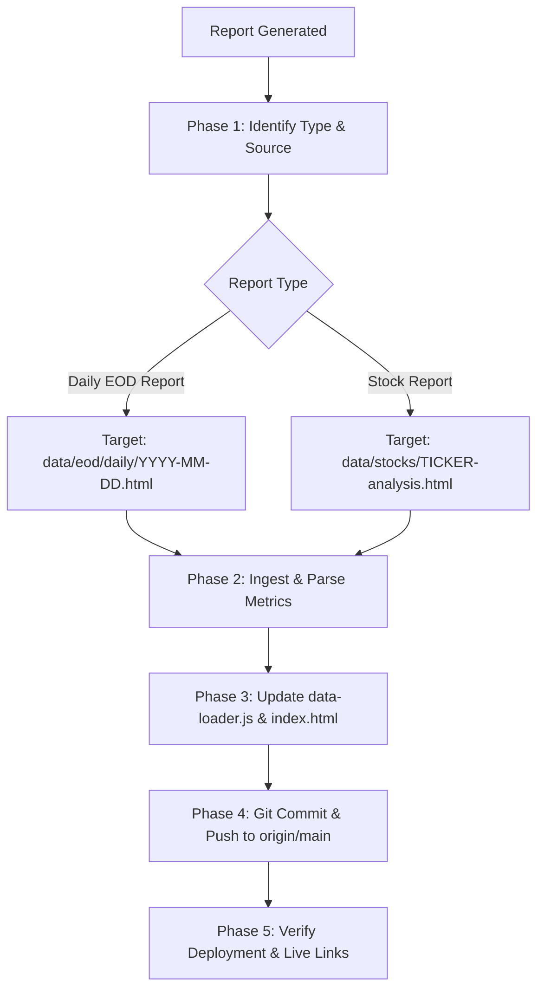

# Update Report to EquityOS (`update-report-to-EquityOS`)

Use this skill to publish newly generated market intelligence notes directly into the **EquityOS** platform and the live **Nifty & Beyond** application hosted on GitHub Pages (`https://rajan1973.github.io/ag-equity-os/`).

This skill runs globally from any Antigravity workspace or project, particularly:
- `D:\Anti Gravity\post-market-report` (after generating a daily post-market brief)
- `D:\Anti Gravity\equity-os` (direct maintenance and updates)
- Any other project producing Indian market research reports

---

## The Workflow



---

## Phase 1: Determine Report Type & Source File

1. **Check Context**:
   - If this skill is invoked immediately after generating a daily EOD report, identify the generated file path or content from the conversation context.
   - If not already specified in the user's request, ask the user to clarify:
     - **Option 1**: Daily EOD Report (Post-market brief for Nifty & Beyond)
     - **Option 2**: Stock Report (Fundamental analysis / equity deep-dive)
     - **Option 3**: Sector Report (Quarterly earnings review / institutional note)

2. **Locate the Source File**:
   - Resolve the file path (e.g., `D:\Anti Gravity\post-market-report\output\2026-09-10.html` or a file in the current working directory).
   - If the user supplied HTML directly in the prompt or generated it in memory, save it to a temporary file or place it directly into the target repository.

---

## Phase 2: Target Repositories & Path Resolution

The canonical local repository path for EquityOS is:
`D:\Anti Gravity\equity-os`

Target destinations inside `equity-os`:
| Report Type | Destination Directory | Standard Naming Convention |
| :--- | :--- | :--- |
| **Daily EOD Report** | `data/eod/daily/` | `YYYY-MM-DD.html` (e.g. `2026-09-10.html`) |
| **Stock Report** | `data/stocks/` | `<ticker>-analysis.html` (e.g. `welcorp-analysis.html`) |
| **Sector Report** | `data/sectors/` | `<sector-slug>-<period>.html` (e.g. `cables-wires-q1fy27.html`) |

---

## Phase 3: Automated Publishing Script

Use the bundled automation script to parse metrics, update `data-loader.js`, update `index.html`, and push to GitHub:

### Command Syntax

```bash
# For Daily EOD Report:
python "C:\Users\arjun\.gemini\config\skills\update-report-to-EquityOS\scripts\publish_to_equity_os.py" --type daily --file "<path_to_report.html>"

# For Stock Report:
python "C:\Users\arjun\.gemini\config\skills\update-report-to-EquityOS\scripts\publish_to_equity_os.py" --type stock --file "<path_to_report.html>" --ticker "<TICKER>"

# Preview without pushing to remote:
python "C:\Users\arjun\.gemini\config\skills\update-report-to-EquityOS\scripts\publish_to_equity_os.py" --type daily --file "<path_to_report.html>" --no-push
```

---

## Manual Execution Checklist (If not using the Python script)

### 1. Ingest Report File
Save or copy the HTML file into the appropriate directory under `D:\Anti Gravity\equity-os\data\...`.

### 2. Update `js/data-loader.js`
For **Daily EOD Reports**:
- Extract:
  - `id` & `date`: `YYYY-MM-DD`
  - `title`: e.g. `Nifty & Beyond — 10 Sep 2026`
  - `file`: `data/eod/daily/YYYY-MM-DD.html`
  - `nifty` & `niftyChange`: e.g. `23,477.80`, `+46.30 (+0.20%)`
  - `sensex` & `sensexChange`: e.g. `74,902.59`, `+138.37 (+0.19%)`
  - `vix` & `vixChange`: e.g. `11.80`, `-0.12`
  - `fii`: e.g. `-438.24`
  - `dii`: e.g. `+1,025.85`
  - `breadth`: e.g. `191:305 (0.63)`
  - `brent`: e.g. `$98.40 (+0.25%)`
  - `usdinr`: e.g. `94.8850 (+0.04%)`
  - `regimeScore`: e.g. `35.7 NEUTRAL`
  - `highlights`: Array of key bullet points from Executive Scorecard (§1)
- Prepend or update the entry in `EquityData.reports.daily`.
- Ensure `EquityData.sortDailyReports()` is called so the latest date is always at index `0`.

### 3. Update `index.html` & Cache-Busting
- Update hero fallback elements:
  - `#hero-date-tag`: `AS OF DD MONTH YYYY`
  - `#hero-open-standalone-btn`: `data/eod/daily/YYYY-MM-DD.html`
  - `#ref-open-latest-btn`: `data/eod/daily/YYYY-MM-DD.html`
  - `#hero-report-iframe`: `data/eod/daily/YYYY-MM-DD.html`
  - `#hero-regime-score`, `#hero-regime-tag`, `#hero-regime-meta`
  - Scorecard tiles (`#sc-nifty-v`, `#sc-sensex-v`, `#sc-vix-v`, etc.)
- **CRITICAL**: Bump the cache-busting query parameter on all scripts and stylesheets:
  ```html
  <link rel="stylesheet" href="css/style.css?v=YYYYMMDD-HHMM">
  <script src="js/data-loader.js?v=YYYYMMDD-HHMM"></script>
  <script src="js/rrg-chart.js?v=YYYYMMDD-HHMM"></script>
  <script src="js/app.js?v=YYYYMMDD-HHMM"></script>
  ```
  *(Without this version string, GitHub Pages' 10-minute HTTP cache will cause users' browsers to serve stale cached data!)*

### 4. Git Commit & Push
Run within `D:\Anti Gravity\equity-os`:
```bash
git add data/ js/data-loader.js index.html
git commit -m "Publish EOD Daily Brief for DD-Mon-YYYY and update app links"
git push origin main
```

---

## Phase 4: Verification & Response Delivery

Once pushed, provide the user with:
1. **GitHub Repository Direct Link**:
   `https://github.com/Rajan1973/ag-equity-os/tree/main/data/eod/daily/` (or `data/stocks/`)
2. **Live Application URL**:
   [Nifty & Beyond — Live Application](https://rajan1973.github.io/ag-equity-os/)
3. **Deployment Note**:
   Inform the user that GitHub Pages takes ~60–90 seconds to rebuild and distribute edge cache, after which the updated report will appear immediately due to the cache-busting version parameter.
