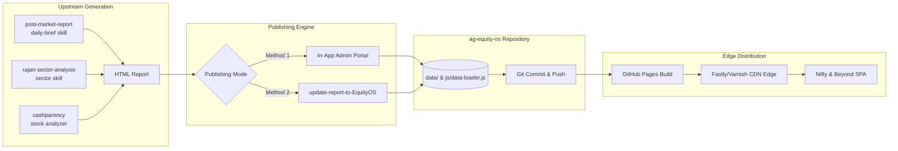
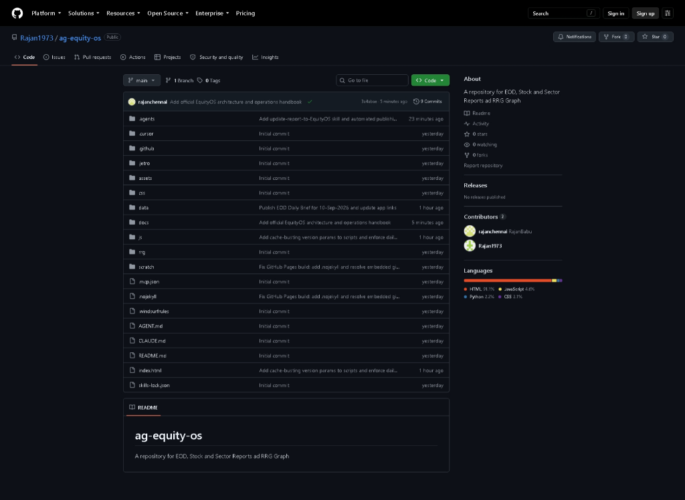
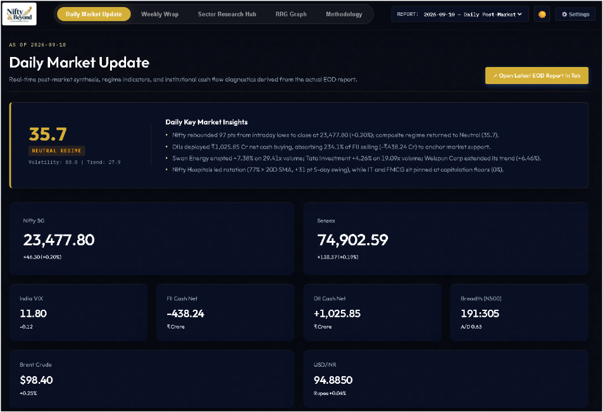
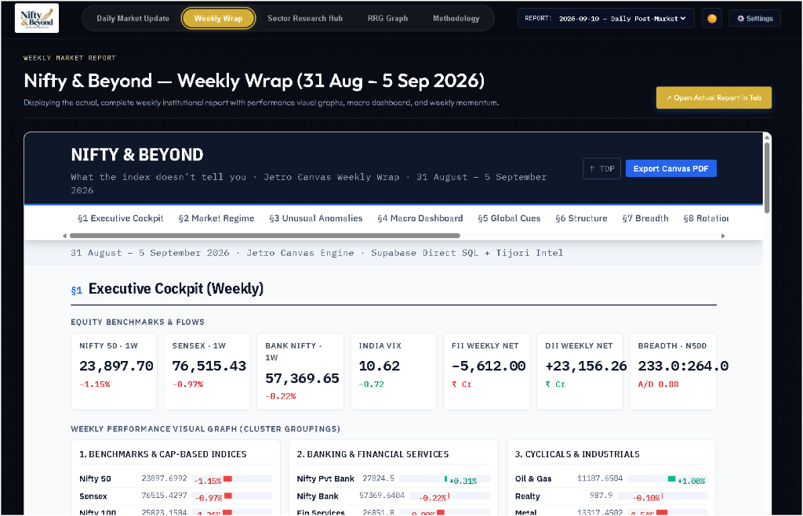
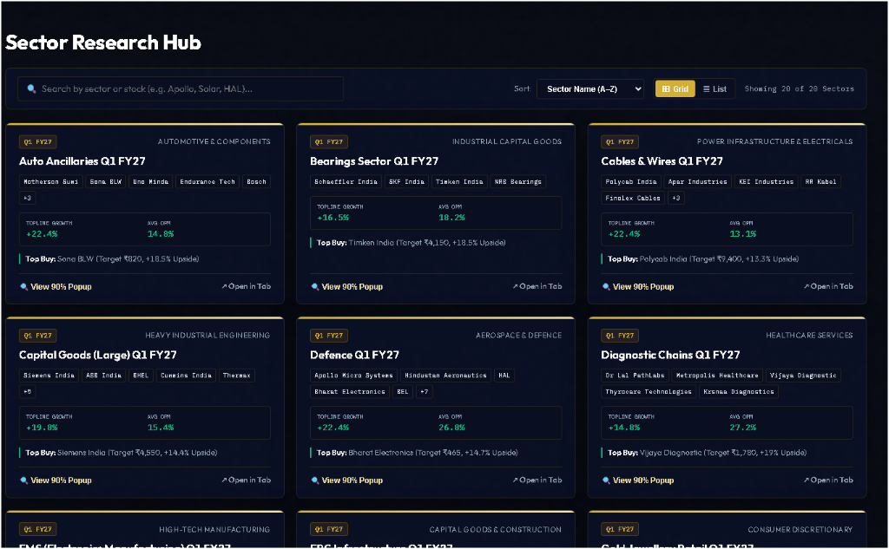
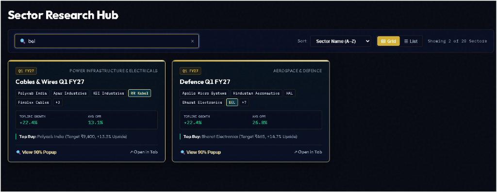
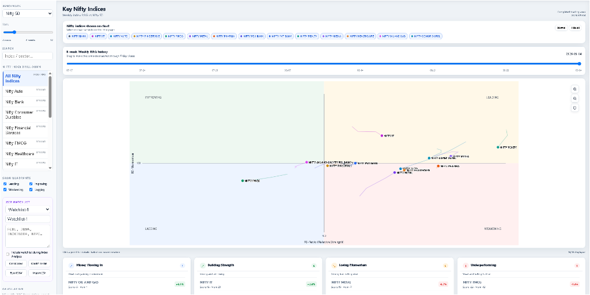
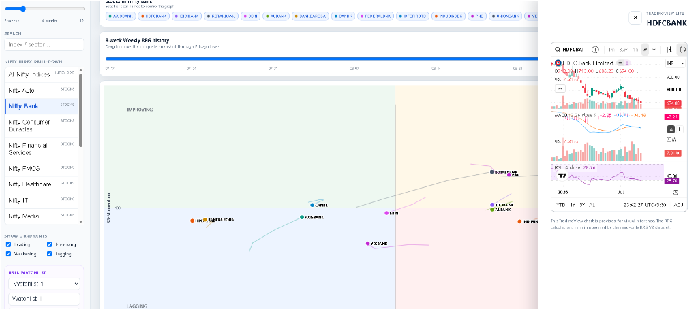

# EquityOS Handbook: Architecture, Operations & Report Publishing Guide

> **Platform**: Nifty & Beyond — *What the index doesn't tell you*  
> **Live Web Application**: [https://rajan1973.github.io/ag-equity-os/](https://rajan1973.github.io/ag-equity-os/)  
> **GitHub Repository**: [https://github.com/Rajan1973/ag-equity-os](https://github.com/Rajan1973/ag-equity-os)  
> **Primary Workspaces**: `D:\Anti Gravity\equity-os` & `D:\Anti Gravity\post-market-report`

---

## Table of Contents

1. [Executive Summary & Architectural Vision](#1-executive-summary--architectural-vision)
2. [Upstream Report Generation Pipeline](#2-upstream-report-generation-pipeline)
   - [2.1 Daily Post-Market Brief (`daily-brief` Skill)](#21-daily-post-market-brief-daily-brief-skill)
   - [2.2 Institutional Sector Research (`rajan-sector-analysis` Skill)](#22-institutional-sector-research-rajan-sector-analysis-skill)
   - [2.3 Fundamental Stock Research (`cashparency-stock-analyzer` Skill)](#23-fundamental-stock-research-cashparency-stock-analyzer-skill)
3. [GitHub Repository Architecture & Data Topology](#3-github-repository-architecture--data-topology)
   - [3.1 Repository Structure & Asset Map (Image 3)](#31-repository-structure--asset-map-image-3)
   - [3.2 The Flat-File Static Philosophy: Why It Empowers EquityOS](#32-the-flat-file-static-philosophy-why-it-empowers-equityos)
4. [EquityOS Web Application Modules In-Depth](#4-equityos-web-application-modules-in-depth)
   - [4.1 Hero Section: Daily Market Update (Image 1)](#41-hero-section-daily-market-update-image-1)
   - [4.2 Weekly Wrap Module (Image 3)](#42-weekly-wrap-module-image-3)
   - [4.3 Sector Research Hub (Image 2)](#43-sector-research-hub-image-2)
   - [4.4 Universal Search & Discovery Engine (Image 4)](#44-universal-search--discovery-engine-image-4)
   - [4.5 Relative Rotation Graph (RRG) Macro Overview (Image 2 / 5)](#45-relative-rotation-graph-rrg-macro-overview-image-2--5)
   - [4.6 RRG Constituent Drill-Down & TradingView Technical Drawer (Image 1 / 6)](#46-rrg-constituent-drill-down--tradingview-technical-drawer-image-1--6)
5. [Settings & Dual-Mode Report Publishing Pipeline](#5-settings--dual-mode-report-publishing-pipeline)
   - [5.1 Application Settings & UI Customization](#51-application-settings--ui-customization)
   - [5.2 Publishing Method 1: In-App Admin Upload Portal](#52-publishing-method-1-in-app-admin-upload-portal)
   - [5.3 Publishing Method 2: Antigravity Skill `update-report-to-EquityOS`](#53-publishing-method-2-antigravity-skill-update-report-to-equityos)
6. [Cache Invalidation & Edge Deployment Strategy](#6-cache-invalidation--edge-deployment-strategy)
7. [Operational Cheat-Sheet & Best Practices](#7-operational-cheat-sheet--best-practices)

---

## 1. Executive Summary & Architectural Vision

**EquityOS** (hosted as *Nifty & Beyond*) is an institutional-grade equity intelligence operating system designed to cut through superficial index numbers and surface underlying market mechanics across the Indian capital markets (NSE & BSE).

Headline indices frequently deceive: an index can rise while 70% of its constituents plunge, or consolidate tightly while rapid, high-volume rotation transfers risk capital into defensive sectors or specialized capex plays. EquityOS aggregates, contextualizes, and visualizes:

1. **Daily Market Regimes**: Composite regime scoring combining Advance/Decline breadth, distance to the 200-day moving average, realized volatility compression, and institutional cash flow absorption.
2. **Weekly Rotation Wraps**: Comprehensive multi-session synthesis with capital flow distribution.
3. **Sector Intelligence Hub**: In-depth quarterly earnings reviews across 20+ specialized industries, benchmarked against management guidance and raw material price cycles.
4. **Relative Rotation Graphs (RRG)**: Dynamic 4-quadrant momentum tracking measuring relative strength (RS-Ratio) and momentum (RS-Momentum) against the Nifty 50 benchmark with interactive single-stock technical drill-downs.



---

## 2. Upstream Report Generation Pipeline

EquityOS does not depend on a costly, fragile backend database server. Instead, it ingests self-contained, high-fidelity research documents generated upstream by specialized AI skills operating in paired Antigravity workspaces.

### 2.1 Daily Post-Market Brief (`daily-brief` Skill)
- **Primary Workspace**: `D:\Anti Gravity\post-market-report`
- **Output Destination**: `data/eod/daily/YYYY-MM-DD.html`
- **Structure**: An institutional 14-section post-market brief:
  - **Movement A (The Read)**: §1 Executive Scorecard, §2 Market Regime (Composite & Ex-Volatility), §3 What's Unusual Today (10 statistical anomaly ranks).
  - **Movement B (The Context)**: §4 Macro & Policy Dashboard, §5 Global Cues, Currency & Commodities (MCX spot, Brent, US Treasuries).
  - **Movement C (The Structure)**: §6 Index Market Structure & Sector Performance, §7 Breadth & Participation (% > 20D SMA ladder), §8 Sector Rotation (Rotating In vs Rotating Out), §9 Stock Scanners (Top 20 Gainers & Losers with 14D/63D volume multiples), §10 Momentum Composite (Fresh entries vs confirmed trends), §11 FII / DII Flows (NSE cash market net purchases and absorption ratios).
  - **Movement D (The Forward View)**: §12 What Changed Today, §13 F&O & Derivatives Positioning, §14 Tomorrow's Action Plan (confirmation triggers and invalidation levels).

### 2.2 Institutional Sector Research (`rajan-sector-analysis` Skill)
- **Invocation**: `/rajan-sector-analysis <Sector Name>` (e.g. `/rajan-sector-analysis Cables & Wires`)
- **Output Destination**: `data/sectors/<sector-slug>-<period>.html`
- **Methodology**: Follows a strict 4-phase institutional protocol:
  1. **Universe**: Lists every listed sector constituent categorized by market cap tier (Large, Mid, Small).
  2. **Selection & Data Feed Check**: Validates active data connectivity with `tijori-finance-mcp` before expending research effort.
  3. **Research**: Gathers audited quarterly earnings, product revenue mix, regional breakdowns, guidance vs delivery track record, and red flags.
  4. **Build**: Compiles a single self-contained HTML document with pure CSS/SVG data visualizations, zero CDN dependencies, and interactive tables.

### 2.3 Fundamental Stock Research (`cashparency-stock-analyzer` Skill)
- **Focus**: High-conviction fundamental equity analysis covering balance sheet strength, return ratios (ROE/ROCE), debt-to-equity trajectories, free cash flow generation, and management execution.
- **Output Destination**: `data/stocks/<ticker>-analysis.html`

---

## 3. GitHub Repository Architecture & Data Topology

The entire platform is hosted publicly at:
**[https://github.com/Rajan1973/ag-equity-os](https://github.com/Rajan1973/ag-equity-os)**

### 3.1 Repository Structure & Asset Map (Image 3)



```
ag-equity-os/
├── .agents/
│   └── skills/
│       └── update-report-to-EquityOS/      # Automated publishing skill
│           ├── SKILL.md
│           └── scripts/
│               └── publish_to_equity_os.py  # End-to-end publishing script
├── assets/                                 # Brand assets, high-res logos
├── css/
│   └── style.css                           # Unified responsive design system & themes
├── data/                                   # IMMUTABLE INTELLIGENCE REPOSITORY
│   ├── eod/
│   │   ├── daily/                          # Daily post-market briefs (e.g. 2026-09-10.html)
│   │   └── weekly/                         # Weekly wrap briefs (e.g. 2026-09-05-weekly.html)
│   ├── sectors/                            # 20+ sector quarterly reports (*-q1fy27.html)
│   ├── stocks/                             # Single-stock fundamental research notes
│   └── rrg/
│       └── nifty-indices-rrg-latest.json    # Weekly RRG matrix (RS-Ratio & RS-Momentum)
├── docs/
│   └── EQUITYOS_HANDBOOK.md                # Comprehensive architecture and operations handbook
├── js/
│   ├── app.js                              # Main UI controller, router, search, modals
│   ├── data-loader.js                      # Centralized report registry & sorting service
│   └── rrg-chart.js                        # HTML5 Canvas Relative Rotation Graph engine
├── .nojekyll                               # Bypasses Jekyll processing for raw HTML serving
├── index.html                              # Main SPA Shell & Scorecard Container
└── README.md
```

#### Language Distribution
As reflected in the repository metadata:
- **HTML (91.1%)**: Represents the self-contained post-market reports, sector research notes, and the main SPA container.
- **JavaScript (4.6%)**: Modular client-side router, search engine, and RRG Canvas engine.
- **Python (2.2%)**: Automated report ingestion and publishing pipeline scripts.
- **CSS (2.1%)**: Custom dark/light mode tokens and typography styling.

---

### 3.2 The Flat-File Static Philosophy: Why It Empowers EquityOS

Unlike traditional financial portals requiring database servers (PostgreSQL, MongoDB), application backends (Node/Python servers), and authentication APIs, EquityOS employs a **Flat-File Static Web Architecture**:

1. **Zero Hosting & Maintenance Cost**: Hosted entirely on GitHub Pages without server upkeep, SQL migrations, or compute overhead.
2. **Instant Edge CDN Delivery**: GitHub Pages routes requests through Fastly/Varnish global CDNs, delivering sub-millisecond document loading worldwide.
3. **Immutable Audit Trail**: Every post-market report and sector revision is tracked via Git commits. Market commentary and forecasts remain timestamped and tamper-evident.
4. **Self-Contained Report Portability**: Every HTML report in `data/` contains its own styles, fonts, and scripts. Reports can be opened offline, emailed, downloaded as PDFs, or embedded seamlessly inside iframes.
5. **Decoupled Autonomous Agent Architecture**: Any Antigravity agent or automated script across any machine can push an updated analysis simply by committing a file and updating the registry.

---

## 4. EquityOS Web Application Modules In-Depth

### 4.1 Hero Section: Daily Market Update (Image 1)



The **Hero Section** (`#tab-hero`) serves as the executive cockpit, greeting the user with immediate market diagnostics from the latest session:

1. **Eyebrow Timestamp (`#hero-date-tag`)**: Displays session date (e.g. `AS OF 10 SEPTEMBER 2026`).
2. **Composite Market Regime Card**:
   - **Regime Score (`#hero-regime-score`)**: A weighted composite metric ranging from 0 to 100:
     - `0.0 – 34.9`: **Bearish Regime** (Orange/Red badge)
     - `35.0 – 59.9`: **Neutral Regime** (Gold/Yellow badge)
     - `60.0 – 100.0`: **Bullish Regime** (Green badge)
   - **Regime Sub-Meta (`#hero-regime-meta`)**: Displays component scores (e.g. `Volatility: 83.0 | Trend: 27.9`).
   - **Key Market Insights List (`#hero-highlights-list`)**: Bulleted summary highlighting top index moves, DII/FII absorption ratios, sector rotation hubs, and volume breakouts.
3. **Unified Asymmetrical Scorecard Masonry**:
   - **Large Tiles**: Nifty 50 (`23,477.80`, `+46.30 (+0.20%)`) and Sensex (`74,902.59`, `+138.37 (+0.19%)`).
   - **Core Tiles**: India VIX (`11.80`), FII Cash Net (`-₹438.24 Cr`), DII Cash Net (`+₹1,025.85 Cr`), and Nifty 500 Breadth (`191:305`, `A/D 0.63`).
   - **Wide Macro Tiles**: Brent Crude (`$98.40`) and USD/INR (`94.8850`).
4. **Embedded Institutional Report Viewer (`#hero-report-iframe`)**:
   - Displays the full HTML report in an interactive iframe with an `↗ Open Fullscreen` standalone tab button.
5. **Daily EOD Reports Archive Grid (`#daily-reports-grid-container`)**:
   - Chronological archive cards of previous sessions showing date, Nifty close, FII/DII flow totals, and regime tags.

#### How Hero Data Is Parsed and Hydrated
EquityOS uses **Dual-Mode Hydration**:
- **Static First Paint**: `index.html` contains static fallback markup of the latest session to eliminate Flash of Unstyled/Empty Content (FOUC).
- **Dynamic JavaScript Hydration**: On `DOMContentLoaded`, `initData()` in `js/app.js` queries `window.EquityData.getLatestDaily()`. It dynamically populates the scorecards, highlights, iframe source, and date selector dropdown (`#report-date-select`).

---

### 4.2 Weekly Wrap Module (Image 3)



Accessible via the **Weekly Wrap** tab (`#tab-weekly`), this view provides multi-day structural perspective:
- **Weekly Executive Cockpit**: Aggregates trailing 5-session returns for Nifty 50, Sensex, Bank Nifty, trailing weekly FII/DII totals, and cumulative breadth.
- **Weekly Performance Visual Graphs**: Cluster groupings comparing Cap-based indices (Large, Mid, Small), Banking & Financials, and Cyclicals vs Defensives.
- **Embedded Canvas Weekly Note**: Houses the complete weekly wrap document (`data/eod/weekly/2026-09-05-weekly.html`) with interactive section jump navigation (§1 Cockpit to §8 Rotation).

---

### 4.3 Sector Research Hub (Image 2)



The **Sector Research Hub** (`#tab-sectors`) is an institutional directory of Indian listed industries covering Q1 FY27 results:
- **Sector Cards**:
  - Category Badge & Period (e.g. `Q1 FY27 · AUTOMOTIVE & COMPONENTS`).
  - Sector Title (e.g. `Cables & Wires Q1 FY27`, `Defence Q1 FY27`, `EMS Q1 FY27`).
  - Stock Constituent Chips: Clickable/searchable tags (e.g. `Polycab India`, `Apar Industries`, `KEI Industries`, `RR Kabel`).
  - Financial KPI Metrics: Topline Growth (YoY %) and Average Operating Profit Margin (OPM %).
  - **Top Buy Pick**: Top-conviction stock recommendation with target price and modeled upside (e.g. `Bharat Electronics (Target ₹465, +14.7% Upside)`).
- **Dual-Action Launchers**:
  - `🔍 View 90% Popup`: Opens an overlay modal (`#report-view-modal`) displaying the complete research note within a sandboxed 90vh viewer.
  - `↗ Open in Tab`: Opens the raw HTML report directly in a standalone browser tab.

---

### 4.4 Universal Search & Discovery Engine (Image 4)



The Universal Search Bar (`#sector-search-input`) provides **cross-dimensional query matching**:
- **Multi-Field Real-Time Indexing**: Matches simultaneously against:
  1. Sector Titles (e.g. *"Defence"*, *"Chemicals"*)
  2. Categories (e.g. *"Industrial Capital Goods"*, *"Aerospace"*)
  3. Constituent Stock Names & Tickers (e.g. typing `"bel"` immediately matches both **Bharat Electronics** in *Defence* and **RR Kabel** in *Cables & Wires*)
  4. Industry Keywords & Themes (e.g. *"solar"*, *"semiconductor"*, *"cdmo"*)
- **Active Filter Highlighting**: Matching constituent chips receive glowing golden border highlights.
- **Live Counter & View Toggles**: Displays filtered count (`Showing 2 of 20 Sectors`) with instant Grid / List layout switching.

---

### 4.5 Relative Rotation Graph (RRG) Macro Overview (Image 2 / 5)



The **RRG Graph** (`#tab-rrg`) implements Julius de Kempenaer’s Relative Rotation Graph algorithm natively in an HTML5 Canvas engine (`js/rrg-chart.js`):

#### Quadrant Mechanics
- **Horizontal Axis (X)**: **RS-Ratio** (Measures relative performance vs Nifty 50 benchmark; >100 is outperforming).
- **Vertical Axis (Y)**: **RS-Momentum** (Measures the rate of change of RS-Ratio; >100 is accelerating momentum).

| Quadrant | Location | Definition | Institutional Action |
| :--- | :--- | :--- | :--- |
| **Leading** | Top-Right | Strong relative strength & accelerating momentum | Heavy overweight allocation |
| **Weakening** | Bottom-Right | Strong relative strength but decelerating momentum | Profit taking / trim exposure |
| **Lagging** | Bottom-Left | Weak relative strength & decelerating momentum | Structural underweight / avoid |
| **Improving** | Top-Left | Weak relative strength but accelerating momentum | Watchlist accumulation / reversal bets |

#### Cockpit Controls
- **Benchmark Selector**: Defaults to `NIFTY 50` (extensible to Sector benchmarks).
- **Tail Length Slider**: Modulates trail history from 1 to 12 weekly nodes.
- **8-Week History Scrubber**: Interactive timeline slider allowing users to rewind the market and replay sector rotation trajectories.
- **Sector Multi-Select Toggles**: Instant on/off filtering of individual index trails.
- **Summary Intelligence Cards**: Four quick-read cards categorized as:
  1. *Money Flowing In* (e.g. Nifty Oil & Gas)
  2. *Building Strength* (e.g. Nifty IT)
  3. *Losing Momentum* (e.g. Nifty Metal)
  4. *Underperforming* (e.g. Nifty FMCG)

---

### 4.6 RRG Constituent Drill-Down & TradingView Technical Drawer (Image 1 / 6)



A flagship feature of EquityOS is the **Constituent Drill-Down Cockpit**:
1. **Sectoral Basket Selector (Left Sidebar)**:
   - Allows users to shift focus from the broad index level (`All Nifty Indices`) down to specific industry universes such as **Nifty Bank**, **Nifty Auto**, **Nifty IT**, **Nifty Financial Services**, or **Nifty Consumer Durables**.
2. **Individual Constituent Stock Chips (Top Ribbon)**:
   - Selecting a sector dynamically populates all constituent stock chips (for example, in *Nifty Bank*: `AXISBANK`, `HDFCBANK`, `ICICIBANK`, `KOTAKBANK`, `SBIN`, `AUBANK`, `BANKBARODA`, `CANBK`, `FEDERALBNK`, `IDFCFIRSTB`, `INDUSINDBK`, `PNB`, `UNIONBANK`, `YESBANK`).
   - Clicking any stock chip toggles its multi-week rotational trail on the RRG canvas.
3. **TradingView Lite Slide-Out Technical Drawer**:
   - Clicking a stock chip launches an integrated **TradingView Lite** drawer on the right pane (e.g. **HDFCBANK**):
     - **Candlestick Price Action**: High-frequency intraday and daily price bars with 52-week context.
     - **MACD Indicator (12, 26, 9)**: Real-time MACD line, signal line, and histogram divergence.
     - **RSI-14 Momentum**: Tracks overbought/oversold boundaries (e.g. RSI 28.76 reflecting deep oversold capitulation).
     - **Volume Dynamics**: Color-coded volume bars vs moving averages.
     - **Multi-Timeframe Horizon**: 1m, 30m, 1h, 1D, 1W, YTD, 1Y, 5Y, All.
   - **Strategic Synthesis**: Bridges top-down macro sector rotation with bottom-up technical execution timing.

---

## 5. Settings & Dual-Mode Report Publishing Pipeline

EquityOS provides two distinct ways to publish newly generated market intelligence notes:

```
┌────────────────────────────────────────────────────────────────────────┐
│                   HOW TO PUBLISH TO EQUITYOS                           │
├───────────────────────────────────┬────────────────────────────────────┤
│ METHOD 1: IN-APP ADMIN PORTAL     │ METHOD 2: ANTIGRAVITY SKILL        │
├───────────────────────────────────┼────────────────────────────────────┤
│ • Upload via Web Browser UI       │ • Run via Antigravity Prompt/CLI   │
│ • Local file picker or path       │ • Operates globally across folders │
│ • Client-side DOMParser scraping  │ • Auto-extracts 15+ metrics        │
│ • Stores in browser localStorage  │ • Updates data-loader.js & HTML    │
│ • Ideal for local draft preview   │ • Auto git commit & pushes to web  │
└───────────────────────────────────┴────────────────────────────────────┘
```

### 5.1 Application Settings & UI Customization
- **Theme Toggle Button (`#theme-toggle-btn`)**: Seamless switching between Dark Mode (`data-theme="dark"`) and Light Mode (`data-theme="light"`).
- **Settings Modal Trigger (`#settings-btn`)**: Prompts for administrative sign-in:
  - **Username**: `admin`
  - **Password**: `password123`

---

### 5.2 Publishing Method 1: In-App Admin Upload Portal

Once signed in via the Settings modal, the **Admin Report Upload Portal** (`#admin-panel-modal`) opens:

1. Select **Daily Market Update** or **Sector Report** tab.
2. Choose a local HTML file via the file picker, or enter a relative path (e.g. `data/eod/daily/2026-09-10.html`).
3. Click **Process & Publish Update ➔**.
4. **Automated Client-Side Scraping**:
   - The browser's native `DOMParser` parses the file.
   - Extracts Nifty, Sensex, VIX, FII/DII cash net flows, breadth counts, and executive highlights.
   - Calls `EquityData.addDailyReport()` or `EquityData.addSectorReport()`.
   - Persists the report in `localStorage` under `nb_custom_daily_reports`.
   - Re-renders the hero scorecard and archive grid immediately.

> [!NOTE]
> Reports uploaded via the in-app portal are active in the local browser session. To publish permanently to the global GitHub Pages site for all users, use **Method 2**.

---

### 5.3 Publishing Method 2: Antigravity Skill `update-report-to-EquityOS`

The **`update-report-to-EquityOS`** skill is a global automation pipeline available across all Antigravity workspaces (`post-market-report`, `equity-os`, etc.).

#### Step 1: Trigger the Skill
Immediately after generating a post-market or stock report in chat, prompt:
> *"Run `update-report-to-EquityOS`"* or *"Publish this report to EquityOS"*

#### Step 2: The Skill Prompts for Report Type
If not already obvious from context, the skill asks:
- **Daily EOD Report** (Target: `data/eod/daily/YYYY-MM-DD.html`)
- **Stock Report** (Target: `data/stocks/<ticker>-analysis.html`)
- **Sector Report** (Target: `data/sectors/<sector-slug>-<period>.html`)

#### Step 3: Fully Automated Execution
The bundled automation script (`publish_to_equity_os.py`) executes:
1. **File Ingestion**: Copies the report into `D:\Anti Gravity\equity-os\data\...` with standardized naming.
2. **Metadata Scraping**: Parses all 15+ scorecard metrics, regime scores, and highlights.
3. **Data Loader Registry Update**: Updates `js/data-loader.js`, deduplicating by ID and sorting dates descending.
4. **Hero Scorecard & Fallback Update**: Updates `index.html` static fallbacks, standalone tab buttons, and iframe links.
5. **Cache-Buster Bumping**: Appends an updated query parameter (`?v=YYYYMMDD-HHMM`) to all CSS and script links.
6. **Git Commit & Push**: Runs `git add`, `git commit -m "Publish EOD Daily Brief for DD-Mon-YYYY"`, and `git push origin main`.

#### Direct CLI Execution Syntax

```bash
# Publish Daily Post-Market Brief:
python "C:\Users\arjun\.gemini\config\skills\update-report-to-EquityOS\scripts\publish_to_equity_os.py" --type daily --file "D:\Anti Gravity\post-market-report\output\2026-09-10.html"

# Publish Stock Fundamental Report:
python "C:\Users\arjun\.gemini\config\skills\update-report-to-EquityOS\scripts\publish_to_equity_os.py" --type stock --file "path\to\report.html" --ticker "WELCORP"

# Dry-run test without pushing to remote:
python "C:\Users\arjun\.gemini\config\skills\update-report-to-EquityOS\scripts\publish_to_equity_os.py" --type daily --file "path\to\report.html" --no-push
```

---

## 6. Cache Invalidation & Edge Deployment Strategy

### The 10-Minute Cache Trap
GitHub Pages serves all static assets (`.js`, `.css`, `.html`) with a `Cache-Control: max-age=600` header (10 minutes).

When an author updates `data-loader.js` and pushes to GitHub, users who previously visited the site will load `data-loader.js` **from browser disk cache**, continuing to see the previous day's data until the 10-minute cache expires.

### The EquityOS Solution: Versioned Cache Busting
`publish_to_equity_os.py` automatically updates script tags in `index.html` with a build timestamp:

```html
<!-- Busted cache guarantees instantaneous edge refresh -->
<link rel="stylesheet" href="css/style.css?v=20260910-2324">
<script src="js/data-loader.js?v=20260910-2324"></script>
<script src="js/rrg-chart.js?v=20260910-2324"></script>
<script src="js/app.js?v=20260910-2324"></script>
```

Whenever a new report is published, browsers recognize a new URL query string and immediately download the updated script, completely bypassing stale edge and browser caches.

---

## 7. Operational Cheat-Sheet & Best Practices

| Workflow | Command / Action | Key Files Affected |
| :--- | :--- | :--- |
| **Generate Daily Brief** | `/daily-brief` in `post-market-report` | `output/YYYY-MM-DD.html` |
| **Generate Sector Review** | `/rajan-sector-analysis <Sector>` | `data/sectors/*.html` |
| **Generate Stock Report** | `/cashparency-stock-analyzer` | `data/stocks/*.html` |
| **Publish to EquityOS** | `/update-report-to-EquityOS` | `data/`, `js/data-loader.js`, `index.html` |
| **Test Local App** | Open `d:\Anti Gravity\equity-os\index.html` in browser | Verified locally |
| **Check Live App** | Visit [https://rajan1973.github.io/ag-equity-os/](https://rajan1973.github.io/ag-equity-os/) | Deployed in ~60s |
| **Verify Git Sync** | `git status` & `git log -n 3` in `equity-os` | `origin/main` branch |
